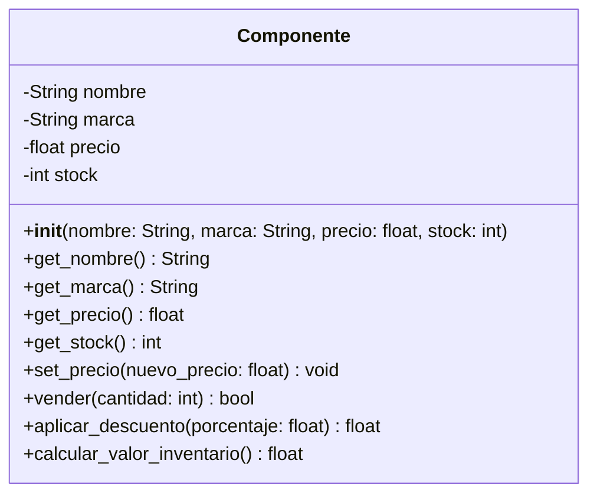

## Guía rápida para leer este diagrama:
El bloque superior: Nombre de la clase (Componente).

El bloque medio (-): Son tus atributos privados. El símbolo - indica que no se pueden tocar desde fuera de la clase.

El bloque inferior (+): Son tus métodos públicos. El símbolo + significa que cualquier parte de tu programa puede llamarlos.

Tipos de datos: Después de los : verás si devuelve un texto (String), un número decimal (float), un entero (int) o un booleano (bool). Cuando un método no devuelve nada (solo hace una acción), se suele poner void o None.

---
## relaciones 
·herecia: lineas con flecha blanca, indican que de los que salen las lienas son hijas de la clase a la que apuntan, la calse padre o superclase 
·asociacion: como el nombre dice solo sirve para asociar cosas o clases son una linea  negra son flecha 
·agreagacion: es un tipo de asociacon de un todo y sus partes, en resumen es una forma de que aun habiendo un todo si algo sale de ahi sige existiendo, y se ve com un diamante blanco
·composiscion: es lo contrario a agragacion, aqui la parte creada no puede existir fuera del todo, depende de una clase para existir y se ve como un diamante negro

---
La clase Componente presentada en el diagrama no posee relaciones con otras clases. Esto se debe a que el modelo se define como una entidad única e independiente, careciendo de conectores 
o líneas que representen vínculos de herencia, asociación, composición o agregación, una relación requiere la interacción de al menos dos elementos; en este caso, solo se visualiza la 
estructura interna de Componente (sus atributos y métodos). Al no existir otras clases declaradas ni flechas que indiquen dependencia o pertenencia, se concluye que es una clase aislada. 
Por lo tanto, la clase encapsula su propia lógica y datos de forma autónoma sin formar parte de una jerarquía o sistema interconectado dentro de este esquema específico

