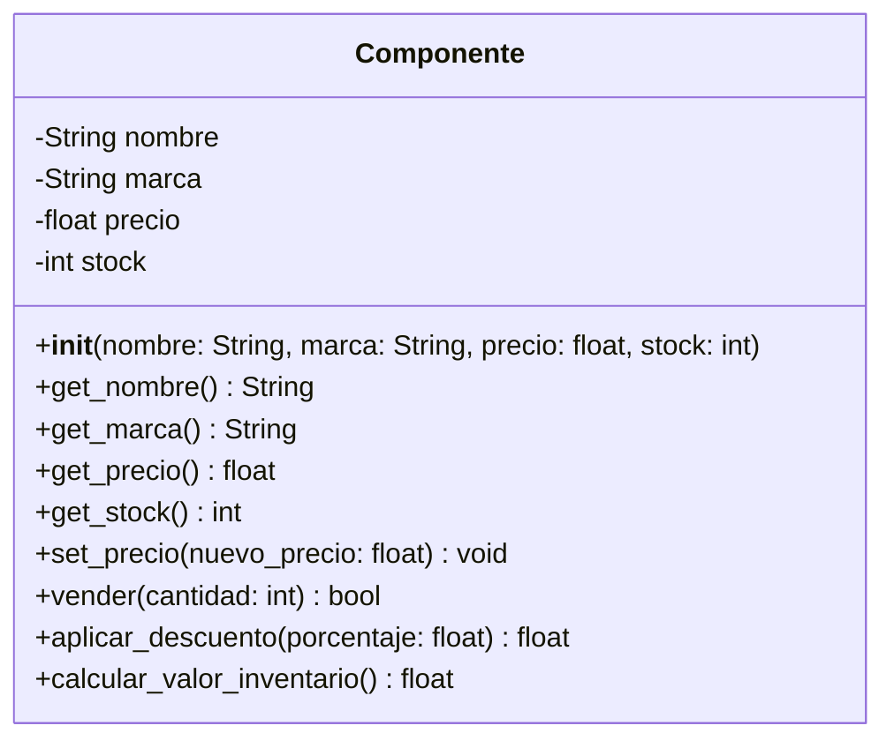

## Guía rápida para leer este diagrama:
El bloque superior: Nombre de la clase (Componente).

El bloque medio (-): Son tus atributos privados. El símbolo - indica que no se pueden tocar desde fuera de la clase.

El bloque inferior (+): Son tus métodos públicos. El símbolo + significa que cualquier parte de tu programa puede llamarlos.

Tipos de datos: Después de los : verás si devuelve un texto (String), un número decimal (float), un entero (int) o un booleano (bool). Cuando un método no devuelve nada (solo hace una acción), se suele poner void o None.

